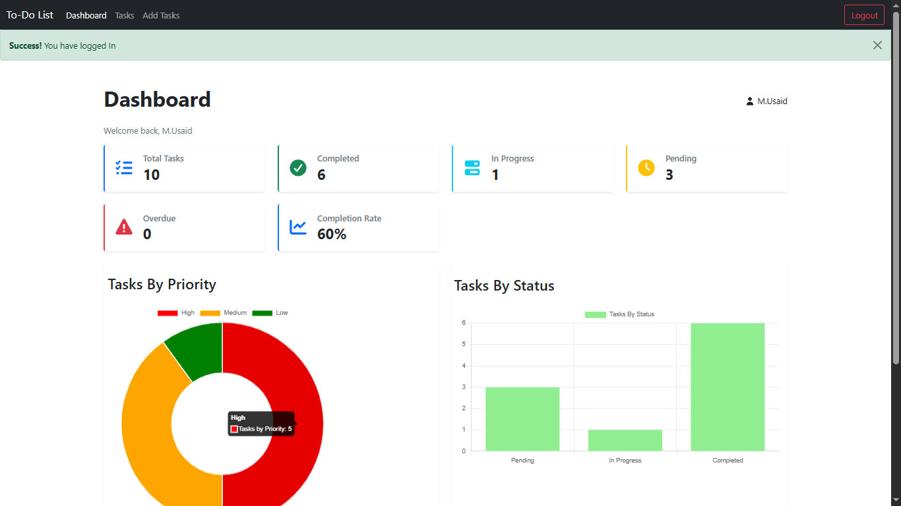
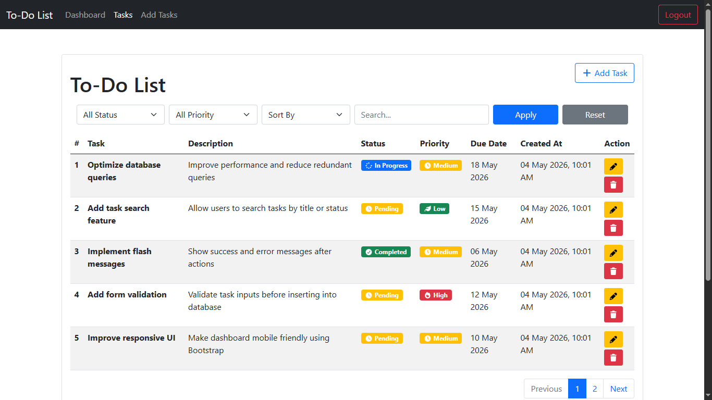
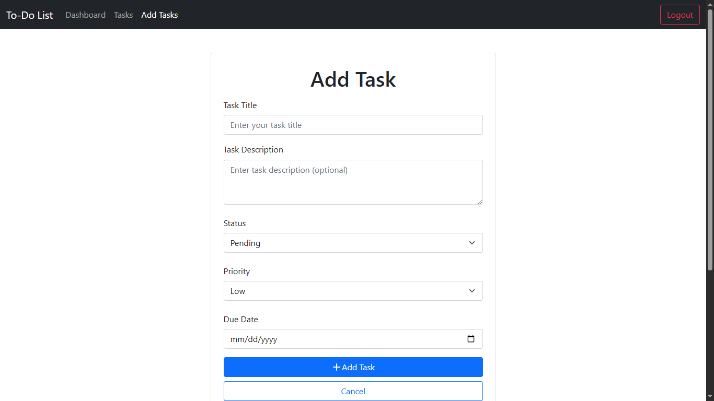
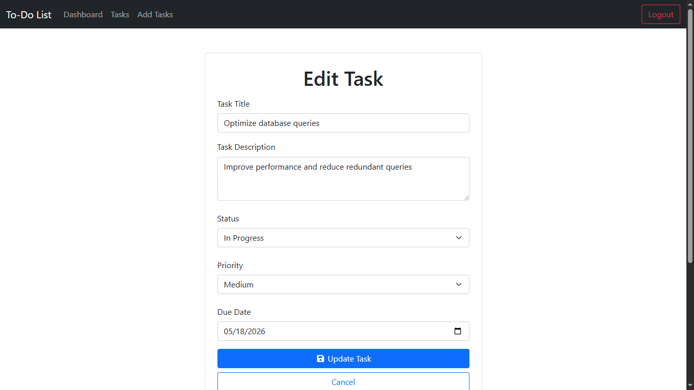

# Task Management System (PHP & MySQL)

A powerful and user-friendly **task management system** built with **PHP, MySQL, and Bootstrap**.
This system is designed for multiple users with authentication, dashboards, analytics, and advanced task management features.

---

## Features

### User Authentication

* Secure Signup & Login system
* Multi-user support
* Session-based authentication

### Dashboard Overview

* Summary cards for quick insights
* Total tasks, completed tasks, pending tasks
* Visual analytics with charts

### Task Management

* Create new tasks
* Edit existing tasks
* Delete tasks
* Update task status (Pending / In Progress / Completed)

### Task Details

* Due date management
* Priority levels (Low / Medium / High)
* Structured table format with clean columns

### Search & Filters

* Search tasks by title
* Filter by:

  * Status
  * Priority
  * Due date

### Charts & Analytics

* Dashboard charts for task progress
* Better visualization of completed vs pending work

### Database Integration

* MySQL database for secure and structured data storage

### Responsive UI

* Built using Bootstrap
* Fully responsive for mobile, tablet, and desktop

---

## Tech Stack

* PHP (Core PHP)
* MySQL
* HTML5
* CSS3
* Bootstrap 5
* JavaScript (basic)

---

## Project Structure

```
/task-management-system
│── /config
│── /includes
│── /assets
│── /screenshots
│── index.php
│── login.php
│── signup.php
│── dashboard.php
│── add_task.php
│── edit_task.php
│── delete_task.php
│── database.sql
│── README.md
```

---

## Installation Guide

1. Clone the repository:

```bash
git clone https://github.com/Usaid136/task-management-system.git
```

2. Move project to XAMPP `htdocs`:

```
C:/xampp/htdocs/
```

3. Import database:

* Open phpMyAdmin
* Create database (e.g. `todo_db`)
* Import `database.sql`

4. Configure database connection:

```
config/db.php
```

5. Run the project:

```
http://localhost/task-management-system
```
---

## Demo

Watch the project demo here:

Youtube: https://youtu.be/er_OuECL-ZY

---

## Screenshots

### Dashboard


### Task List View


### Add New Task


### Edit Task


---

## Future Improvements

* Email notifications for due tasks
* Drag & drop task management
* Role-based access (Admin/User)
* API integration for mobile app
* Dark mode UI

---

## Author

**M. Usaid**

* GitHub: https://github.com/Usaid136
* LinkedIn: https://www.linkedin.com/in/m-usaid-saddiq-110500320/

---

## ⭐ Support

If you like this project, please consider giving it a ⭐ on GitHub.
It really helps and motivates me to build more projects!
